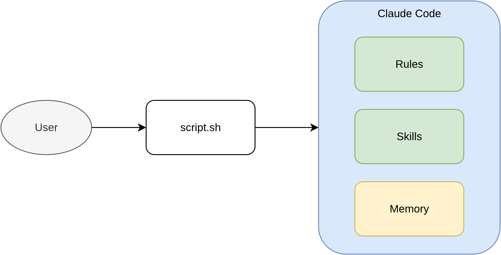

## Builder

Claude Code configuration with rules and skills for autonomous development.



## What is this?

- `.claude/rules/` — passive instructions Claude always follows (coding style, principles, git workflow)
- `.claude/skills/` — active workflows Claude executes on demand (PRD generation, feature conversion)
- `.claude/memory/` — persistent context Claude retains across sessions (user preferences, project state)
- `script.sh` — executes Claude autonomously to build new features from a PRD

## How it works

```
Feature description → script.sh → Claude reads PRD → implements stories → commits → done
```

## Usage

```bash
./script.sh [max_iterations]
```

Claude will read `prd.json`, pick the highest priority unfinished story, implement it, and repeat until all stories pass or max iterations is reached.

## Branches

- `prod` — stable, production-ready config
- `dev` — active development
